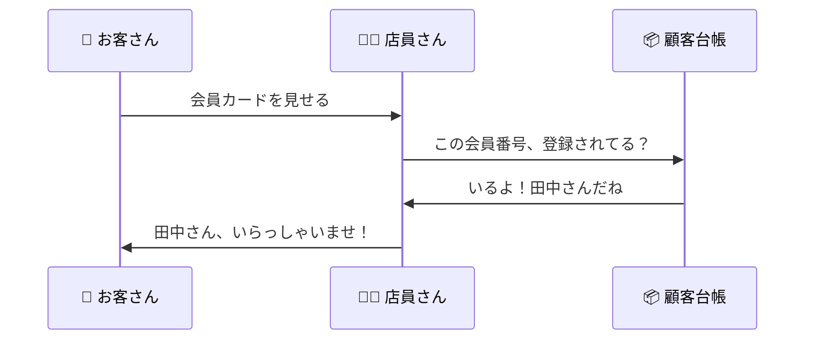
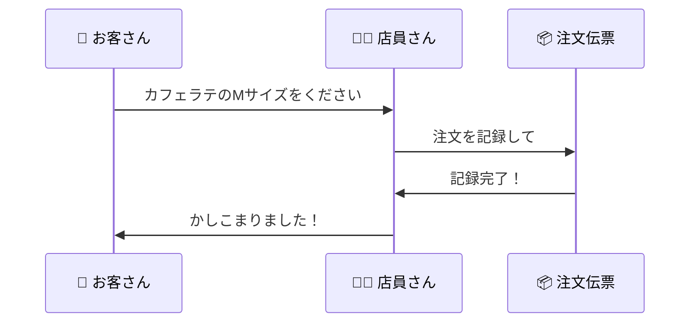

# はじめに

「Webアプリってどうやって動いてるの？」

プログラミングを始めたばかりの頃、私もこの疑問を抱えていました。
毎日使っているWebサービスだけど、裏側で何が起きているのか全く分からない。

この記事では、**カフェで注文する流れ**に例えながら、Webアプリの仕組みを解説します。
一度この例えで理解すれば、どんなWebアプリを見ても「あ、これはあの仕組みね」と分かるようになりますよ。

---

# 登場人物を紹介

まず、Webアプリを動かすために必要な「登場人物」を紹介します。


| Webの世界 | カフェで例えると |
|:--|:--|
| あなた（ブラウザ） | お客さん |
| インターネット | 店内の通路 |
| サーバー | 店員さん |
| データベース | 厨房・倉庫 |

カフェに行ったことがあれば、もうWebアプリの基本は理解できたようなものです。

---

# 実際の流れを見てみよう

## カフェでコーヒーを注文する

あなたがカフェに入って、コーヒーを注文して、受け取るまで。
この流れが、そのままWebアプリの仕組みです。


### ステップ1：リクエスト（注文する）

あなた（ブラウザ）が店員さん（サーバー）に「ホットコーヒーをください」とお願いします。

Webの世界では、これを**リクエスト**と呼びます。
ブラウザでURLを入力したり、ボタンをクリックしたりするたびに、このリクエストが飛んでいます。

### ステップ2：処理（準備する）

店員さん（サーバー）が注文を受けて、厨房（データベース）でコーヒーを準備します。

「コーヒー豆はどこにある？」「このお客さんは常連だからサイズアップしておこう」など、裏側でいろいろな処理が行われています。

### ステップ3：レスポンス（受け取る）

店員さん（サーバー）から「お待たせしました、ホットコーヒーです」と商品が渡されます。

Webの世界では、これを**レスポンス**と呼びます。
画面に表示されるページやデータは、すべてこのレスポンスとして届いています。

:::message
💡 この **「リクエスト → 処理 → レスポンス」** の流れが、Webアプリの基本です！
:::

---

# フロントエンドとバックエンド

Webアプリは大きく2つの部分に分かれています。
カフェで言えば「客席エリア」と「厨房エリア」です。


## フロントエンド（客席エリア）

お客さんから見える部分です。

カフェで言えば、おしゃれな内装、メニュー表、レジのディスプレイなど。
見た目が良ければ「また来たいな」と思いますよね。

Webアプリでは、ボタンの色、文字の大きさ、画像の配置などがこれにあたります。

使う技術：
- **HTML**：お店の骨組み（壁、テーブル、カウンター）
- **CSS**：お店の装飾（色、照明、レイアウト）
- **JavaScript**：お店の動き（自動ドア、呼び出しベル）

## バックエンド（厨房エリア）

お客さんからは見えない部分です。

カフェで言えば、厨房、倉庫、在庫管理システムなど。
お客さんは見えないけど、ここがしっかりしていないと美味しいコーヒーは出てきません。

Webアプリでは、データの処理や保存がこれにあたります。

使う技術：
- **サーバー**：店員さんの動き（注文を受けて、作って、渡す）
- **データベース**：倉庫（コーヒー豆、牛乳、お客さんの情報を保存）

---

# 具体例で理解しよう

## 例1：常連さんがお店に来たとき（ログイン）



Webアプリのログインも同じです。
メールアドレスとパスワード（会員カード）をサーバー（店員さん）に渡すと、データベース（顧客台帳）で確認して、合っていればログイン成功となります。

## 例2：新しいメニューを注文するとき（データ作成）



ブログの投稿、SNSへの書き込み、会員登録なども同じ流れです。
新しいデータをサーバーに送ると、データベースに保存されます。

---

# URLって何？

ブラウザの上に表示されている `https://cafe-example.com/menu` みたいなやつ。
これは「お店の住所と、何を注文するか」を表しています。


| URLの部分 | カフェで例えると |
|:--|:--|
| `https://` | セキュリティがしっかりしたドア（鍵付き） |
| `cafe-example.com` | お店の住所と名前 |
| `/menu` | 「メニューを見せて」という注文 |

例えば `/menu` を `/order` に変えれば「注文したい」になるし、`/history` なら「注文履歴を見せて」になります。

---

# 注文の種類（HTTPメソッド）

カフェでも、店員さんへのお願いにはいろいろな種類がありますよね。
Webの世界でも同じで、これを**HTTPメソッド**と呼びます。


| メソッド | カフェでの例 |
|:--|:--|
| **GET** | 「メニューを見せてください」（情報をもらう） |
| **POST** | 「カフェラテを1つ注文します」（新しく作ってもらう） |
| **PUT** | 「やっぱりMサイズからLサイズに変更で」（内容を変える） |
| **DELETE** | 「すみません、注文をキャンセルしたいです」（なくす） |

ほとんどのWebアプリは、この4つの組み合わせでできています。

---

# APIって何？

よく聞く「API」という言葉。
これは **「お店のメニュー表」** だと思ってください。

メニュー表には「コーヒー 400円」「カフェラテ 450円」と書いてありますよね。
お客さんはメニューを見て、書いてあるものだけ注文できます。
メニューにない「ラーメン」を注文しても、カフェでは作ってもらえません。

APIも同じで、**「こういうリクエストを送ったら、こういうレスポンスが返ってくるよ」** というルールが決まっています。

```
【カフェのメニュー（API）の例】

GET /menu → メニュー一覧が返ってくる
POST /order → 注文が登録される
GET /order/123 → 注文番号123の状況が返ってくる
DELETE /order/123 → 注文番号123がキャンセルされる
```

---

# データベースって何を保存してるの？

データベースは「カフェの業務ノート」だと思ってください。
お客さんの情報、注文履歴、在庫状況などが整理されて保存されています。

### お客さん台帳（usersテーブル）

| 会員番号 | 名前 | メール | 登録日 |
|:--|:--|:--|:--|
| 1 | 田中太郎 | tanaka@example.com | 2023-01-15 |
| 2 | 佐藤花子 | sato@example.com | 2023-02-20 |
| 3 | 鈴木一郎 | suzuki@example.com | 2023-03-10 |

### 注文履歴（ordersテーブル）

| 注文番号 | 会員番号 | 商品 | 注文日時 |
|:--|:--|:--|:--|
| 1 | 1 | カフェラテ M | 2024-01-15 12:30 |
| 2 | 2 | ホットコーヒー L | 2024-01-15 14:00 |
| 3 | 1 | 抹茶ラテ S | 2024-01-15 15:30 |

このように表形式で整理されているので、「田中さんの注文履歴を全部見せて」と言われてもすぐに取り出せます。

---

# 全体の流れをおさらい

最後に、Webアプリの全体像をまとめます。


カフェの例で考えると、こうなります。

1. **お客さん（ブラウザ）** がお店に入って注文する（リクエスト）
2. **店員さん（サーバー）** が注文を受けて、厨房に伝える
3. **厨房・倉庫（データベース）** で材料を取り出して準備する
4. **店員さん（サーバー）** がお客さんに商品を渡す（レスポンス）
5. **お客さん（ブラウザ）** が商品を受け取って楽しむ

どんなWebアプリも、基本はこの流れです。

---

# まとめ

Webアプリの仕組み、なんとなく分かりましたか？

:::message alert
📝 **覚えておきたい5つのポイント**

1. **リクエストとレスポンス**：カフェで注文して商品を受け取るのと同じ
2. **フロントエンドとバックエンド**：客席エリアと厨房エリア
3. **データベース**：お客さん情報や注文履歴を保存する業務ノート
4. **API**：「こう注文したら、こう返ってくる」というメニュー表
5. **URL**：お店の住所 + 何を注文するか
:::

カフェに行くたびに「あ、今リクエスト送ったな」「店員さんがサーバーで、厨房がデータベースか」なんて考えてみてください。
Webアプリの仕組みが、もっと身近に感じられるはずです。

---

# 次のステップ

この記事で興味を持った方は、次はこんなことを学んでみるといいかもしれません。

| 学ぶこと | カフェで言うと | できるようになること |
|:--|:--|:--|
| HTML/CSS | 内装を作る | Webページの見た目を作れる |
| JavaScript | 自動ドアや呼び出しベル | ページに動きをつけられる |
| Node.js / Python | 店員さんの仕事 | サーバーを作れる |
| SQL | 業務ノートの書き方 | データベースを操作できる |

最初の一歩として、簡単なWebページを作ってみることをおすすめします！

---

最後まで読んでいただき、ありがとうございました！
質問やフィードバックがあれば、コメントでお気軽にどうぞ 🙌
